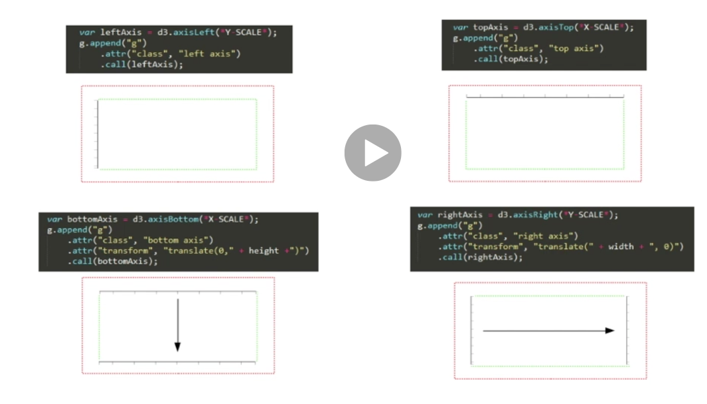

### Main topics
 
 Why does this matter? You need labels to interpret your bar chart. Clearly.

  * Using D3 axis generators in bar chart to show scale
  * Adding axis labels to tell us what we're looking at

### How do we make axis?

D3 has 4 inbuilt methods to generate axis. We'll most often use:
  - `d3.axisLeft('Y Scale')` and `d3.axisBottom('X Scale')`

But we can also use:
  - `d3.axisLeft('Y Scale')` and/or `d3.axisBottom('X Scale')`.

All of these will be based in the origin/center of our canvas (top or left), so we need to move them to the proper place if the axis is on the right or bottom.

Example Screenshot of code

To do the movement, we'll want to place the axis in a `group` and `translate` them.
Afterwards, we use the `.call()` method to generate the axis.

#### Customizing the ticks

