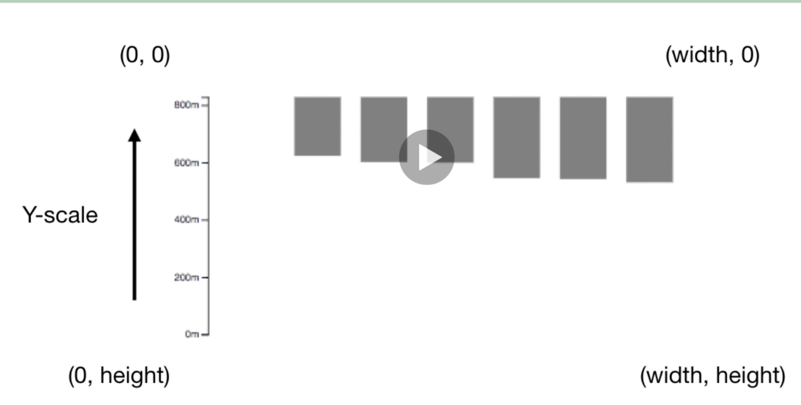

### OBjectives

  * Reverse our y scale; 
  * make bars go from bottom up instead of top down (sit on x-axis)
  * Explore the SVG coordinate system

### What's going on with our data?

  Our 0 is at the top of the canvas, so the values increase as we go down. This affects our scale and bars seperately and both require different fixes. 

#### How do we fix our scale?

  Flip our range. *If we have a larger input value, we want it to have a smaller distance from the top of our SVG canvas.*
  
  So we go from something like:
```js
var y = d3.scaleLinear()
    .domain([0, d3.max(data, (d) => d.height) ])
    .range([0, height]);
```
to
```js
var y = d3.scaleLinear()
    .domain([0, d3.max(data, (d) => d.height) ])
    .range([height, 0]);
```

| Before | After |
| :--: | :--: |
| | |


#### How do we fix our bars?

  Once we fix our scale, it still looks bizare.
  
  

  Here, our tallest bar has a height of 0.
  

  So if we take the difference we should be good.

### 3.11 Code Example