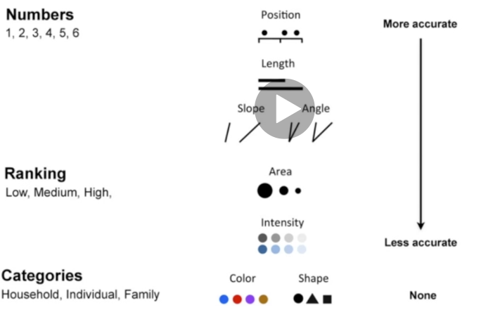

I've already read books on design, so I'll be blasting through this section

### 30: Intro

  There are best practices to be aware of, different types of graphs, data, good clarity, and we'll be introduced to the boot strap CSS grid system.

### 31: Design for clarity

  * Best practices for visual design
  * Intro to Tufte's design principles (clear, easy to read data visualizations)
  * Ex of good and bad uses of visualizations

What are key design factors?
  * Make the dat easy to interpret
  * Be truthful/credible: don't mislead
  * Focus on important stuff

Tufte's principles focus on staying honest to the data and eliminating distracting elements:

Summary of visualizations with Tufte's principles
  * Be truthful and don't distort meaning. Ex: y axis should start w/ 0 to avoid over exageration
  * Lie factor: Size of effect in data vs size of graphic. Should be as close to 1 as possible.
  * Chart Junk: Elements that don't add extra info. In general, unnecessary elements, framing elements, background elements, 3d things, are typically bad.
  * Data to Ink ratio can measure chart junk. Focus on high data to ink.

### 32: Subjectivity in Design

  * What makes a great visualization?
  * Is chart junk a bad thing? Some chart junk others argue are necessary
  * Examples of good visualizations that don't follow Tufte's principles

What are goals for viz?
  * Grab users attention
  * Encourage further exploration
  * Build new and interesting types of visualizations

Ex: histogram of military spending. Histograms are harder to understand than a barchart. And each histogram is a bullet... lots of chart junk

Ex: Node link: interactive.

Design is still subjective. 

### 33: Activity: critiquing visualizations

1. Visualization of coffee: Eye catching, but I don't know what hte bars or colors even mean.
2. Lancaster Bingo. A lot of negative space. I love dashboards and they're clear and have a good amount of data to ink. I like the color scheme too. Issue is the pie chart in the middle
3. Rap vocab, indifferent towards. I get that it's a scatter plot at first, which is interesting because each point is represented by a face. I guess that is somewhat clarifying, but also adds a lot of distraction (to me)

As an aside, I just learned about https://pudding.cool/2018/12/3d-cities-story/ and https://pudding.cool/ which is a pretty cool site. 

### 34: The design toolkit

Questions for Design:

  * How do we show the data we have in the best way?
  * When should we use color? Color scheme selection
  * How do we deal with different types of data?

How do we think about available options for displaying our data?

Jacque Bertin proposed:
  * position, size, grey value, texture, color, orientation, and shape to convey different data.

Ex
  Length? Easy
  Slope/steaper? a bit harder than length
  Circle area: 5x. Challenging/area
  Darkness? 2x. A bit easier.
  Using color scale, how much? It's harder when colors are diverging

So in short, some channels are better at expressing some data.

Every data falls into quantitative (numerical), categorical (categories), ordinal (rankings)

What are some recommendations on visualizing different data?

For ordinal data, area or intensity are ideal.

#### How to use colors?
  * Don't use over 5-8 colors. Don't use diverging color scale for quantitative dat
  * Also, consider color-blind users (~5% of the population)
  * colorbrewer2 is useful

### 35: Intro to sketching

  Sketching is useful to get an ouitline/idea going.

  Why do we need sketches?

  * Figure out how site should look before diving into programming
  * Think through different options of communicating data
  * Communicating abstract ideas to clients and colleagues

Rules for sketches?

  * Make them as disposable as possible to keep an open mind. Scratch paper
  * Make them big, at least half a side of an A4 page. Bold as possible so everything is clear
  * Get the general point across ; don't worry about details, don't draw lines with rulers or focus on scale.

  No more than 5 minutes for initial sketch

### 36: Making sketches

https://www.udemy.com/course/masteringd3js/learn/lecture/9441206#notes

### 37: Bootstrap grid system

### 38: Summary